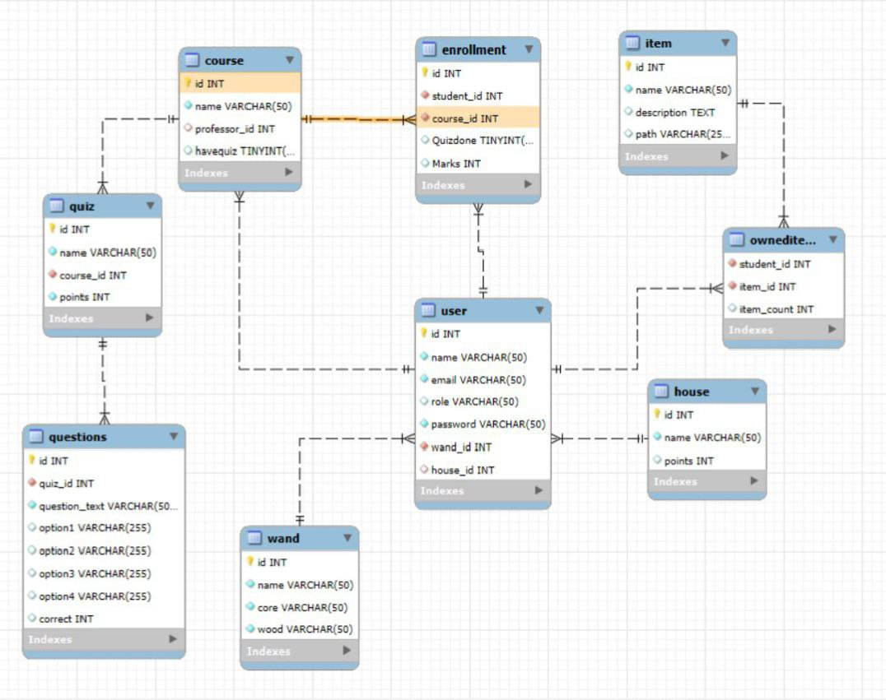

# 🏰 Hogwarts Magic School Project

## ✨ Overview

Welcome to **Hogwarts Magic School**! This project is a magical platform where users can experience the world of wizardry, enroll in courses, take quizzes, and engage in exciting activities. Below is an overview of the system's functionalities:

## 🛠 Features

### 🧙‍♂️ Admin Panel

Admins have the following powers:

- View all **users**.
    - Promote **professors** to admin.
    - **Delete** any user.
- **Grand Admin** can:
  - View all **available courses**.
  - See which **professors** are teaching each course.
- **Professor Admin** can:
  - View only the courses they teach.
  - **Add quizzes** to their courses.

### 🎩 User Features

Users have access to:

- **Profile Page** 📜
  - View their **name, email, house, and wand**.
- **Course Enrollment** 🏫
  - Enroll in any available course.
  - Take quizzes and receive **grades**.
- **Shop** 🛒
  - Purchase magical items.
- **Inventory** 🎒
  - Items appear in the **Inventory Page.**

## 🏆 Houses Leaderboard 
  - View the ranking of houses based on **total points**.

## 📊 House Points System

- Each house's **total points** are calculated from the sum of all students' grades within that house.
- The leaderboard appears on both **Admin and User dashboards**.

## 📌 Prerequisites

Before running the project, ensure you have the following installed:

1. **XAMPP** 🖥️

    - Download and install **XAMPP** from Apache Friends.

    - Start Apache and MySQL from the **XAMPP** Control Panel.

2. **Clone the Repository** 🧳

```
git clone <repository_url>
cd <project_directory>
```

3. **Import the Database** 🗄️

    - Open phpMyAdmin (http://localhost/phpmyadmin).

    - Create a new database and import the provided SQL file.

    - Run the Project 🚀

    - Place the project folder inside htdocs.

    - Open your browser and go to http://localhost/Hogwarts-for-programming/.


## 🚀 Technologies Used

- Backend: **PHP**
- Frontend: **HTML / CSS**
- Database: **MySQL**

## 🎭 Magic Awaits!

Embark on your wizarding journey and let the spells begin! 🪄✨

---

## ERD





