# 🏰 Hogwarts Magic School Project

## ✨ Overview
Welcome to Hogwarts Magic School! This project is a magical platform where users can experience the world of wizardry, enroll in courses, take quizzes, and engage in exciting activities.

## 🧐 Features
### Register

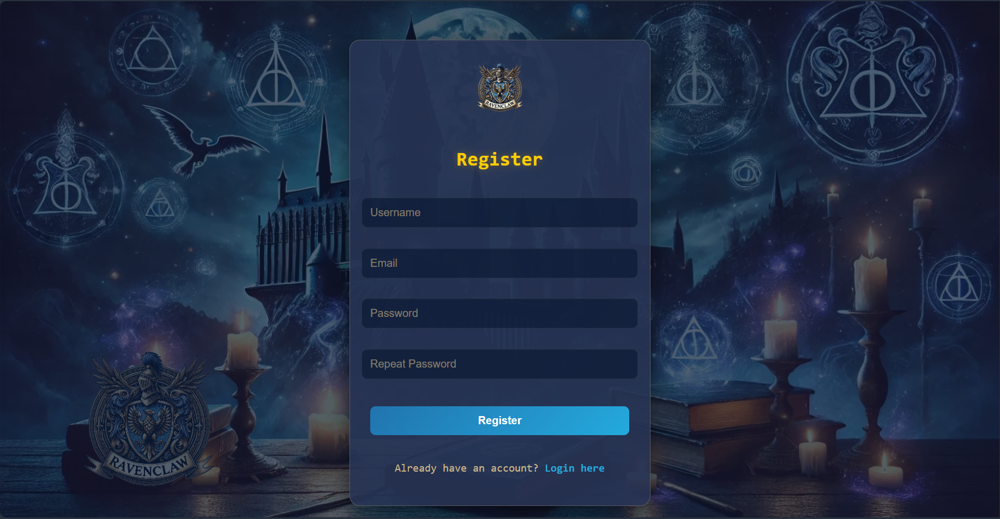

### login

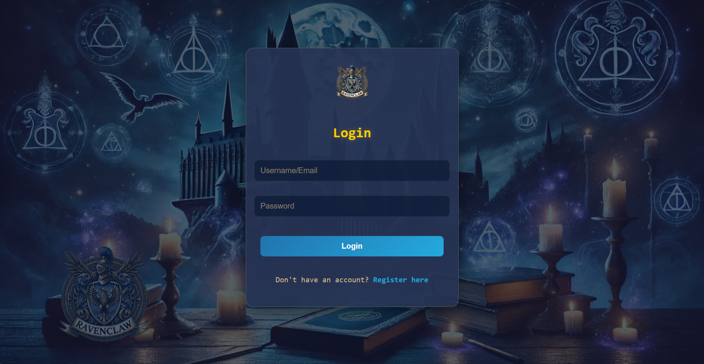

### 🎩 User Features
Users have access to:
- **Profile Page** 📜
  - View their name, email, house, and wand.

  

- **Course Enrollment** 🏭
  - Enroll in any available course.

  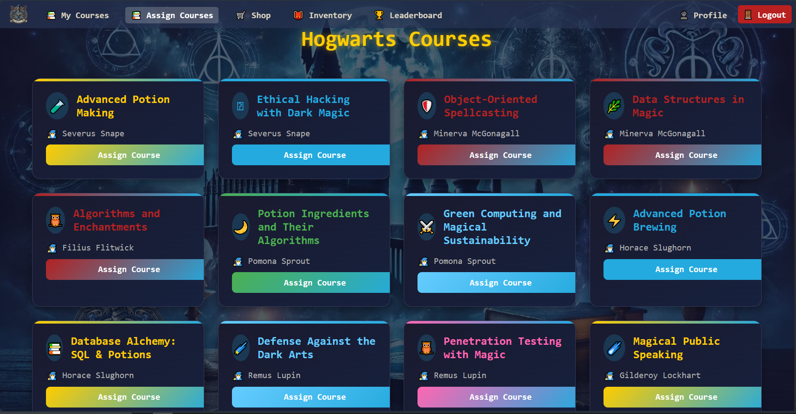

  - Take quizzes and receive grades.
  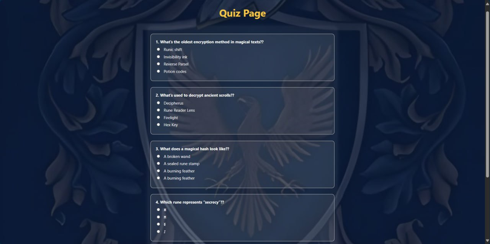

- **Shop** 🛒
  - Purchase magical items.

  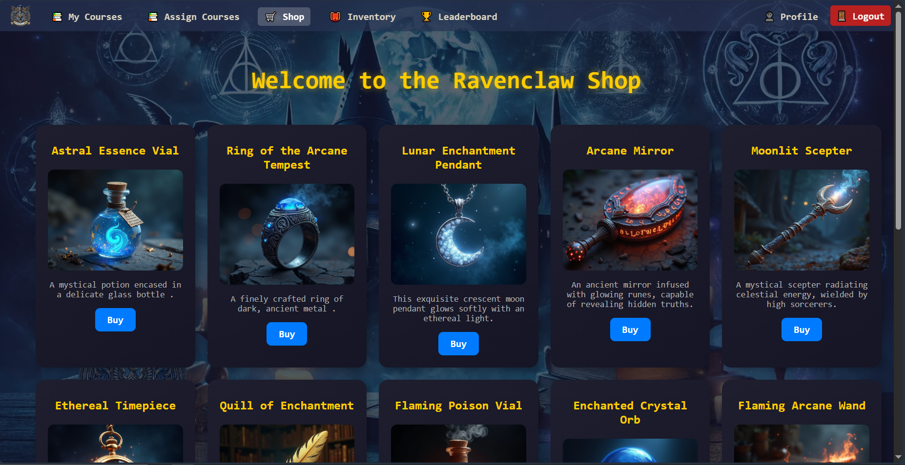

- **Inventory** 🎒
  - Items appear in the Inventory Page.

  

- **🏆 Houses Leaderboard**
  - View the ranking of houses based on total points.

  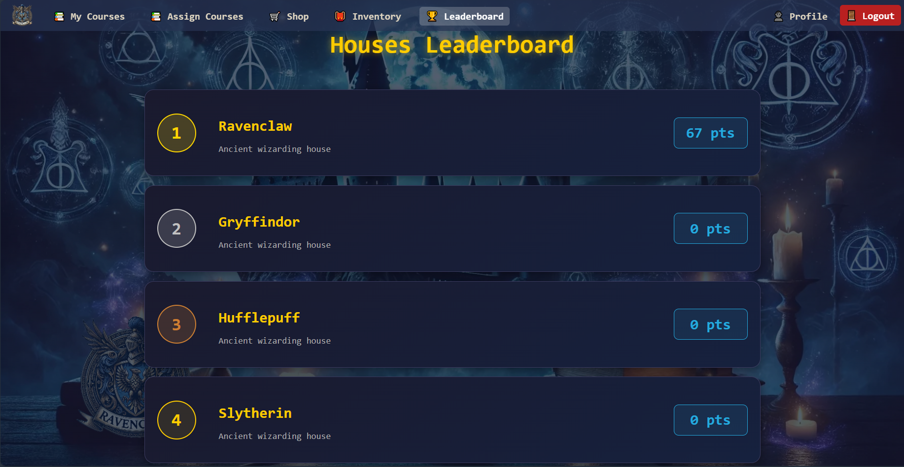

- **📊 House Points System**
  - Each house's total points are calculated from the sum of all students' grades within that house.
  - The leaderboard appears on both Admin and User dashboards.

### 🧙‍♂️ Admin Panel
Admins have the following powers:
- View all Students.
- Promote professors to admin.
- Delete any user.

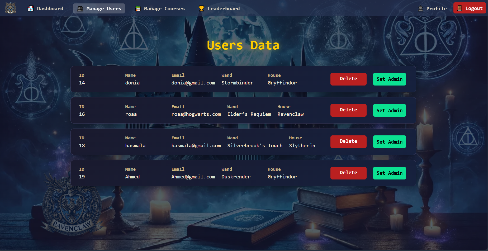

#### Grand Admin can:
- View all users Students or professors

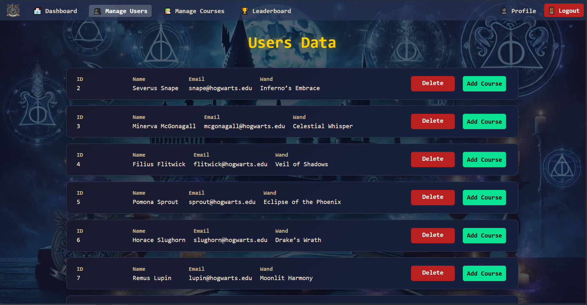

- add to a specific professor a course

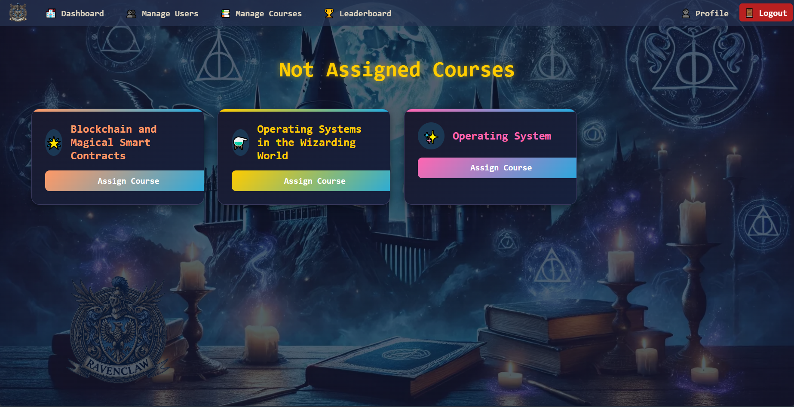

- View all available courses.
- See which professors are teaching each course.

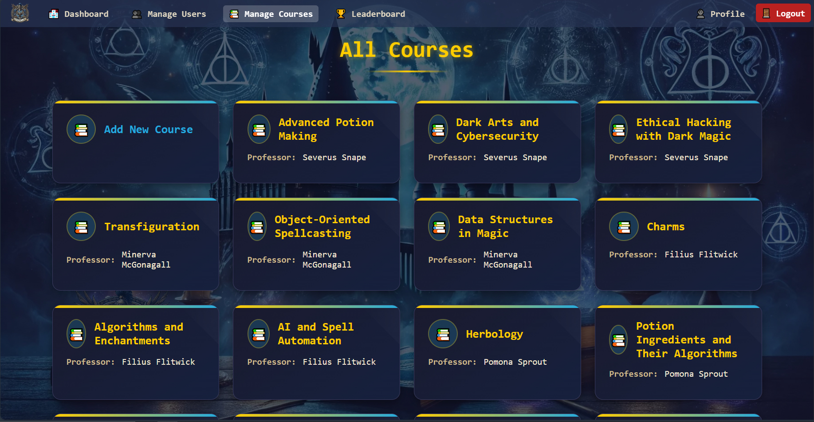

- add new course to any professor

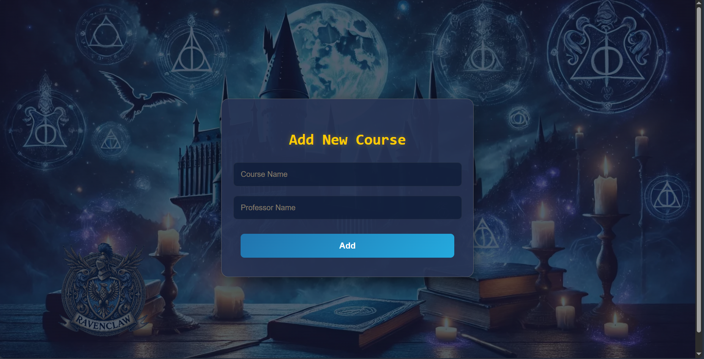


#### Professor Admin can:
- View only the courses they teach.


- Add quizzes and its questiones to their courses.

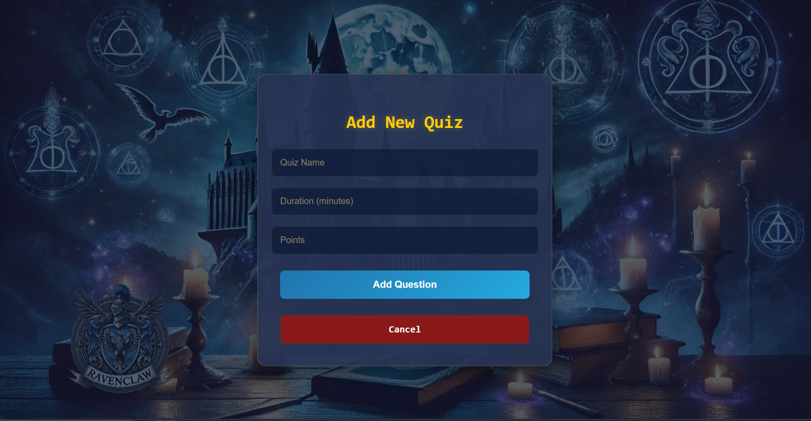

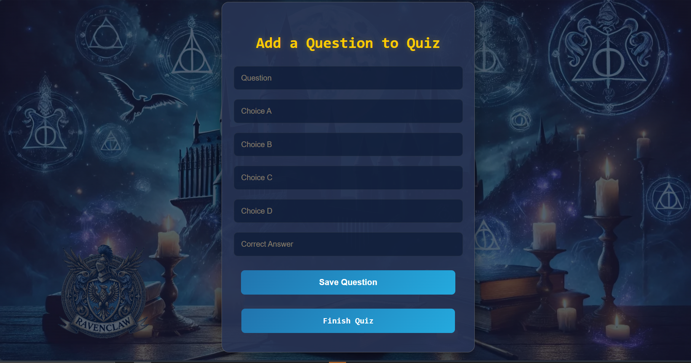


## 📂 Project Directory Structure
```
Directory structure:
└── zeyadzahran-hogwarts-for-programming/
    ├── Readme.md
    ├── index.php
    ├── router.php
    ├── .htaccess
    ├── admin/
    │   ├── adminClass.php
    │   ├── index.php
    │   ├── navPar.php
    │   ├── courses-controllers/
    │   │   ├── index.php
    │   │   ├── AddCourse/
    │   │   │   ├── index.php
    │   │   │   ├── newcourse.php
    │   │   │   └── savecourse.php
    │   │   └── AddQuiz/
    │   │       ├── addquestion.php
    │   │       ├── addquiz.php
    │   │       ├── index.php
    │   │       ├── savequestion.php
    │   │       └── savequiz.php
    │   ├── main/
    │   │   ├── dashboard.php
    │   │   ├── index.php
    │   │   ├── leaderBoard.php
    │   │   ├── manageCourses.php
    │   │   ├── manageUsers.php
    │   │   └── profile.php
    │   └── users-controllers/
    │       ├── adminContr.php
    │       ├── deleteContr.php
    │       ├── index.php
    │       └── addCourse/
    │           ├── addcourse.php
    │           ├── addcoursecontr.php
    │           └── index.php
    ├── classes/
    │   ├── dbh.classes.php
    │   ├── edit-contr.classes.php
    │   ├── editprofile.classes.php
    │   ├── login-contr.classes.php
    │   ├── login.classes.php
    │   ├── signup-contr.classes.php
    │   └── signup.classes.php
    ├── dataBase/
    │   ├── erd.PNG
    │   ├── query.sql
    │   └── Schema.sql
    ├── includes/
    │   ├── edit.inc.php
    │   ├── login.inc.php
    │   └── signup.inc.php
    ├── src/
    │   ├── 403.php
    │   ├── 404.php
    │   ├── editprofile.php
    │   ├── index.php
    │   ├── login.php
    │   └── logout.php
    ├── Styles/
    │   └── style.css
    └── user/
        ├── assignCourse.php
        ├── index.php
        ├── navPar.php
        ├── userClass.php
        ├── main/
        │   ├── courses.php
        │   ├── dashboard.php
        │   ├── index.php
        │   ├── inventory.php
        │   ├── LeaderBoard.php
        │   ├── ManageCourses.php
        │   ├── profile.php
        │   └── shop/
        │       ├── BuyItem.php
        │       ├── index.php
        │       ├── shop.php
        │       ├── shopCntr.php
        │       └── img/
        └── quiz/
            ├── done.css
            ├── done.php
            ├── index.php
            ├── quiz.php
            ├── quize.css
            └── structureQuiz.php


```

## 📌 Prerequisites
Before running the project, ensure you have the following installed:

1. **XAMPP** 🖥️  
   - Download and install XAMPP from [Apache Friends](https://www.apachefriends.org/).
   - Start Apache and MySQL from the XAMPP Control Panel.

2. **SQL Server (MySQL)** 📂  
   - Ensure you have MySQL installed to manage the database.

## 🚀 Setting Up the Project
### 1. Clone the Repository 🎩
```
git clone https://github.com/Zeyadzahran/Hogwarts-for-programming.git
cd Hogwarts-for-programming
```

### 2. Import the Database 📚
1. Open **phpMyAdmin** (`http://localhost/phpmyadmin`).
2. Create a **new database**.
3. Import the provided SQL files in the following order:
   - `Schema.sql` (to set up the database structure)
   - `query.sql` (to populate the database with initial data)

### 3. Run the Project 💥
1. Place the project folder inside `htdocs`.
2. Open your browser and go to:
   - `http://localhost/Hogwarts-for-programming/`.

## 🎭 Magic Awaits!
Embark on your wizarding journey and let the spells begin! 🧙‍♂️🫶🌟


